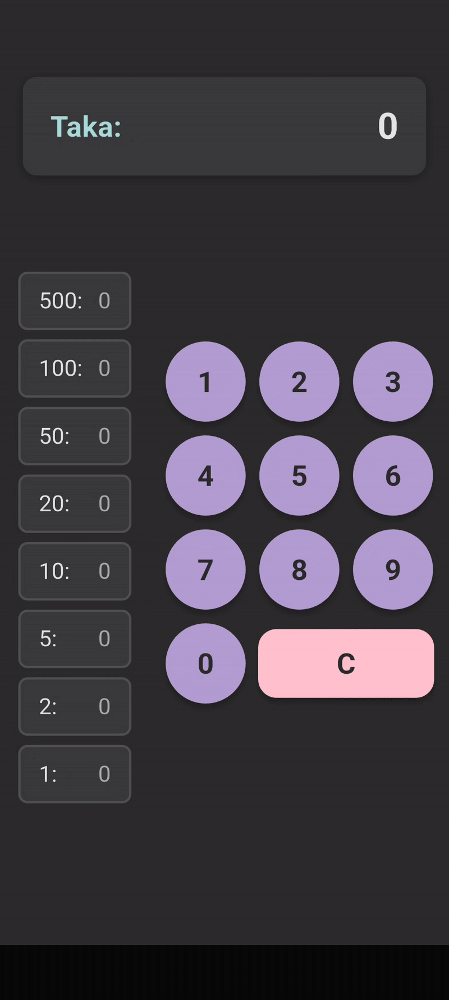
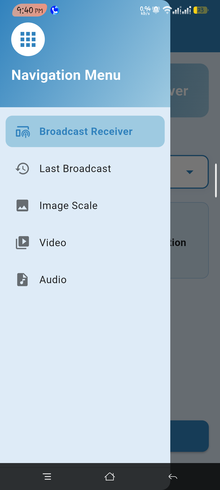

# Flutter Learning Workspace

This folder is a personal workspace to organize multiple Flutter learning projects for **CSE489 - APP Development**. Each project lives in its own subfolder with complete Flutter implementation.

---

## Projects

### 1. **Experiment** 
A basic Flutter experiment project exploring fundamental concepts.

---

### 2. **VangTiChai**
A currency/unit conversion calculator application.

**Features:**
- Real-time conversion calculations

---

### 3. **DrawerCustom**
A Flutter project demonstrating custom drawer navigation implementation.

---

### 4. **Midmap**
A comprehensive map that shows data with coordinates .

**Screenshots:**

| Overview | List View | Dark Mode |
|----------|-----------|-----------|
|  |  |  |

| New Entry | Update Entry | Edit (Swipe Right) |
|-----------|--------------|-------------------|
|  |  |  |

| Delete (Swipe Left) | Bottom Sheet |
|-------------------|--------------|
|  |  |

---

*Last Updated: December 2025*